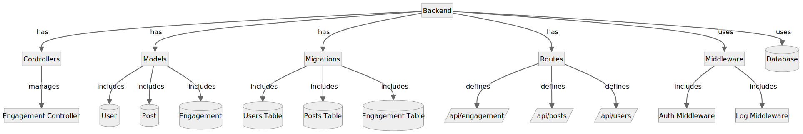
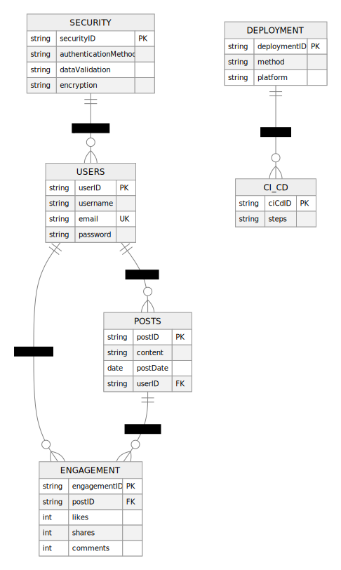

# Social Media Analytics Dashboard

## Overview

The Social Media Analytics Dashboard is a web application designed to provide insights into social media metrics. Built using PHP with the Laravel framework for the backend and integrating modern frontend technologies, this application provides a comprehensive and interactive way to analyze social media engagement data.

## Architecture

### Frontend

The frontend of the application is designed to be dynamic and responsive, implemented using Angular, a platform for building mobile and desktop web applications.

**Frontend Features:**

- Interactive charts to visualize social media metrics (e.g., engagement over time).
- Responsive design for different devices and screen sizes.
- Data fetching from backend APIs to populate charts and other UI components.
- Component-based architecture for reusable and maintainable code.
- Angular Router for managing navigation and routing within the application.
- Angular Material for UI components and design consistency.


### Backend

The backend is built using **Laravel**, a modern PHP framework. Laravel provides a robust set of tools and features for building scalable and maintainable web applications.

**Backend Components:**

- **Controllers**: Handle incoming requests and return responses. For example, `EngagementController` manages the retrieval of engagement data.
- **Models**: Represent the data structures. Models include `User`, `Post`, and `Engagement`.
- **Migrations**: Define the database schema and handle schema changes. Migrations for `users`, `posts`, and `engagements` tables are included.
- **Routes**: Define the endpoints exposed by the API. For instance, `/api/engagement` retrieves engagement data.
- **Middleware**: Handles tasks such as authentication and logging.

**Backend Features:**

- RESTful API endpoints to interact with the frontend.
- Integration with social media APIs for data retrieval.
- Data processing and storage in a relational database (MySQL or PostgreSQL).



### Database

The application uses a relational database to store and manage data. The database schema includes:

- **Users Table**: Stores information about users, including username and platform.
- **Posts Table**: Contains details about social media posts, such as content and post date.
- **Engagement Table**: Tracks engagement metrics, including likes, shares, and comments.

**Database Features:**

- Relational design for efficient data retrieval and management.
- Use of ORM (Eloquent) for easy database interaction.

### Data Processing

Data processing may be handled either within PHP or using external tools such as Python scripts.

- **Internal Processing**: Basic data manipulation and aggregation performed within Laravel.
- **External Processing**: Advanced data analysis or machine learning tasks handled by Python scripts, which can be integrated into the backend.

### Deployment

The application is containerized using Docker and can be deployed using modern cloud platforms and orchestration tools.

**Deployment Components:**

- **Docker**: Containerizes the application for consistency across development, testing, and production environments.
- **Docker Compose**: Defines and runs multi-container Docker applications, including the PHP backend, frontend, and database services.
- **Kubernetes**: Optional for managing containerized applications at scale.
- **Cloud Providers**: AWS, Azure, or Google Cloud for hosting the application.

**Deployment Features:**

- Continuous Integration/Continuous Deployment (CI/CD) pipelines for automated testing and deployment.
- Monitoring and logging to ensure application health and performance.

### Security

Security practices are incorporated at multiple levels:

- **Authentication**: Secure access to the application using OAuth 2.0 or other authentication mechanisms.
- **Data Validation**: Input validation to prevent SQL injection and other vulnerabilities.
- **HTTPS**: Ensures secure communication between clients and the server.



## Getting Started

1. **Clone the Repository**

    ```bash
    git clone https://github.com/simichanga/social-media-dashboard.git
    cd social-media-dashboard
    ```

2. **Install Dependencies**

    ```bash
    composer install
    npm install
    ```

3. **Configure Environment**

    Copy .env.example to .env and update configuration settings.

    ```bash
    cp .env.example .env
    ```

4. **Run Migrations**

    ```bash
    php artisan migrate
    ```

5. **Start the Development Server**

    ```bash
    php artisan serve
    npm run dev
    ```

6. **Access the Application**

    Open http://localhost:8000 in your web browser.

## Contributing

Contributions are welcome! Please refer to the CONTRIBUTING.md for guidelines.

## License

This project is licensed under the MIT License.